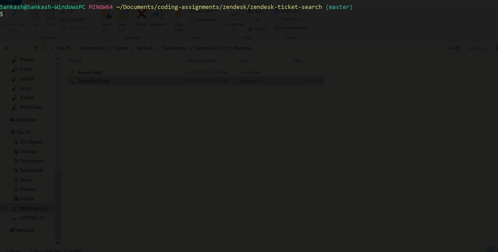

# Zendesk Search Application - Sankash Thakuria

## Scope
This application provides basic search functions that can be used to query data from the organizations.json, tickets.json and users.json. All searches work on exact matches, partial match isn't implemented in this version of the application. Dates are matched as strings without locale information.

## Assumptions
* The use of external libraries is allowed
* Search for empty values is assumed to be an empty string `""` 
* Fast searches are required and hence in-memory caching is implemented

## Requirements

* [Java 8](https://www.java.com/en/download/) or higher
* [Maven](https://maven.apache.org/) 3.5.4


## Usage

The application can be run via Apache Maven from the commandline. `cd` into the project directory that contains the pom.xml file and issue `mvn clean install`. This will build the project.

To run the application with the json files that were provided for the challenge, issue the following:

```shell
mvn exec:java
```
To run the tests issue the following:
```shell
mvn test
```

The project can also be run from Intellij Idea. To do so, import as maven project, navigate to the `App.java` class and run the `main` method.

 
## Search 

* Strings are matched in a case-insensitive fashion
* To search for array elements in json, just pass the name of the field. If the array contains that field, match will occur
* Timestamps are matched as strings
* The user is shown a list of choices in via a menu when the application is launched. Every field name maps to an number. This number has to be typed in to perform the match. See a sample execution in the [Demonstration](#Demonstration) section

## Limitations
* Partial matches isn't implemented, only exact matches are performed.

## Demonstration
Below is sample execution of the program


## Sample results

###Organization

```shell
-----------------------------------Displaying Search Results-------------------------------------------

----------------------------------------------------------------------------------------------------
Organization

id                       |       123
url                      |       http://initech.zendesk.com/api/v2/organizations/123.json
externalId               |       12831719-9173-47c7-8834-fa5b26877393
name                     |       Terrasys
domainNames              |       [isoplex.com, equicom.com, premiant.com, combogen.com]
createdAt                |       2016-04-23T04:40:09 -10:00
details                  |       MegaCorp
sharedTickets            |       true
tags                     |       [Fisher, Forbes, Koch, Lester]

        Users

        Name: Josefa Mcfadden                                   |       Email: caseymcfadden@flotonic.com, Phone: 8715-273-472
        Name: Rosa Wright                                       |       Email: joneswright@flotonic.com, Phone: 8034-232-199
        Name: Morris Ayers                                      |       Email: tonyaayers@flotonic.com, Phone: 9355-543-308
        Name: Boone Cooke                                       |       Email: rhodescooke@flotonic.com, Phone: 8955-022-065
        Name: Deanna Terry                                      |       Email: lyndaterry@flotonic.com, Phone: 9924-522-038

                Tickets

                Id: be0f613a-e7f7-4833-9342-643b0d9b9fca        |       Subject: A Drama in Cayman Islands
                Id: f3cc4dc6-3517-474b-b212-b82fdaa0800d        |       Subject: A Catastrophe in Laos
                Id: 0e74f193-cd11-4803-93e1-807eb0e37874        |       Subject: A Drama in Venezuela
                Id: 6d6dbb5b-2b74-46a9-8e0a-8d8140f63412        |       Subject: A Nuisance in Comoros
                Id: cdc9926f-e44a-4530-af17-903cf2fa3cdf        |       Subject: A Catastrophe in Rwanda
                Id: 5f7a19db-432e-4d6f-8c29-ba121aed5d68        |       Subject: A Problem in Cambodia
                Id: 5799c5e4-2c48-4319-8c5b-88df58ebbd12        |       Subject: A Nuisance in French Polynesia
                Id: 0f0868ba-518c-4e1b-b286-41e0937c4e7c        |       Subject: A Problem in Reunion
                Id: 3d5ec1b4-509c-45de-8338-4934531d48f3        |       Subject: A Catastrophe in Bouvet Island
                Id: f21a653e-6576-4cc8-a848-70d1f9ab5d1c        |       Subject: A Nuisance in Slovenia
                Id: eba628f6-5c97-4f4e-b39d-fb78850661df        |       Subject: A Problem in Brunei Darussalam
                Id: 196721ae-1691-4113-901d-4e39675a22c1        |       Subject: A Drama in Puerto Rico

----------------------------------------------------------------------------------------------------

-----------------------------------End of Results------------------------------------------------------

```

### User

```shell
-----------------------------------Displaying Search Results-------------------------------------------

----------------------------------------------------------------------------------------------------
User

serialVersionUID         |       3531563685459955226
id                       |       37
url                      |       http://initech.zendesk.com/api/v2/users/37.json
externalId               |       bfd8811a-706b-4a18-9708-c14a87b9bb1e
name                     |       Denise Finch
alias                    |       Miss Bailey
createdAt                |       2016-04-18T06:31:09 -10:00
active                   |       true
verified                 |       true
shared                   |       false
locale                   |       de-CH
timezone                 |       Reunion
lastLoginAt              |       2015-10-23T05:18:08 -11:00
email                    |       baileyfinch@flotonic.com
phone                    |       8745-103-166
signature                |       Don't Worry Be Happy!
organizationId           |       110
tags                     |       [Fairforest, Windsor, Hayes, Brecon]
suspended                |       true
role                     |       admin
Tickets Assigned

        Assigned Tickets: Ticket Id: b539a7db-1166-4537-9a5e-d2a97dd432bd, Ticket Subject: A Catastrophe in Lesotho
        Assigned Tickets: Ticket Id: 5c66cef0-7abc-46df-b487-5f8eb6208422, Ticket Subject: A Problem in Switzerland
Tickets submitted

        Submitted Tickets: Ticket Id: 4b88dee7-0c17-4fe2-8cb6-914b7ce93dc3, Ticket Subject: A Drama in East Timor
        Submitted Tickets: Ticket Id: cb7cae87-2915-44d4-bda4-4ccb59c63bd4, Ticket Subject: A Drama in S. Georgia and S. Sandwich Isls.
```

### Tickets   
```shell     
    Tickets
    id                       |       4eea5790-b490-4dee-877f-808d86cbd1a8
    url                      |       http://initech.zendesk.com/api/v2/tickets/4eea5790-b490-4dee-877f-808d86cbd1a8.json
    externalId               |       c6250ca2-1098-426b-b274-9202dc4cae50
    createdAt                |       2016-02-26T06:34:34 -11:00
    type                     |       problem
    subject                  |       A ▒atastrophe in Sudan
    description              |       Lorem quis culpa eiusmod culpa eu. Aute ullamco anim nostrud consequat consequat ipsum aliquip ipsum.
    priority                 |       low
    status                   |       pending
    submitterId              |       66
    assigneeId               |       73
    organizationId           |       113
    tags                     |       [New Mexico, Nebraska, Connecticut, Arkansas]
    hasIncidents             |       false
    dueAt                    |       2016-07-31T06:51:48 -10:00
    via                      |       web
    
```
## Note
* Running with Java 9 throws up a few warnings which are due to Google Guice. These are safe to ignore.
* The problem statement stated that search should still return a result if a field such as description in the tickets.json is empty. Since there wasn't an empty value  for description I decided to make an empty entry myself. This entry is appended at the end of the file.
## Tech

Some of the libraries that this project uses are the following:

* [Google Guice](https://github.com/google/guice) - Dependency Injection Framework
* [Junit 5](https://junit.org/junit5/) - Testing framework
* [Mockito](https://site.mockito.org/) - Testing Framework
* [PowerMock](https://github.com/powermock/powermock) -Testing Framework
* [Jackson](https://github.com/FasterXML/jackson) - JSON Parsing library
* [Project Lombok](https://projectlombok.org/) - Fantastic library that takes away a lot of boiler plate

